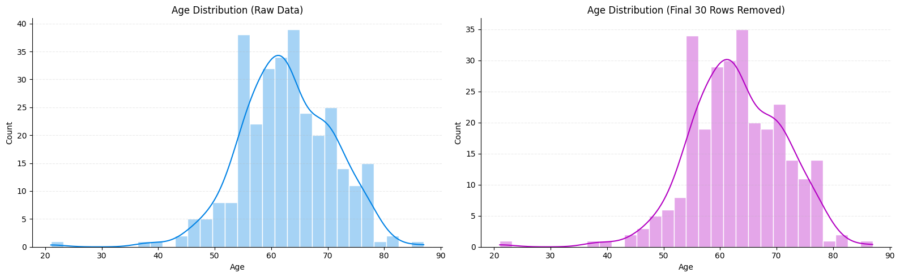
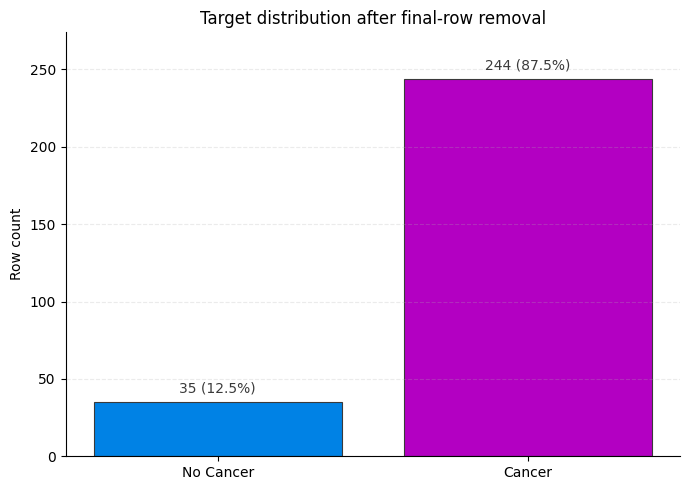
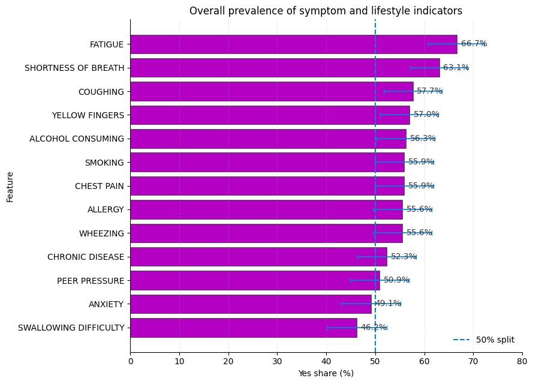
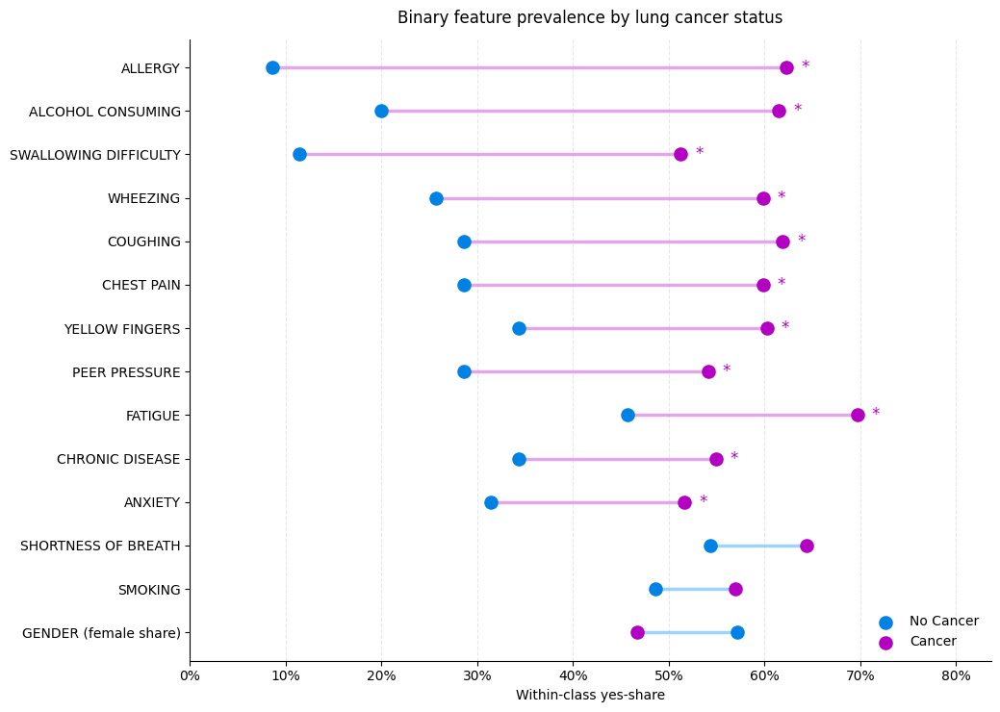
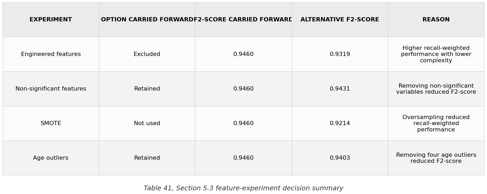
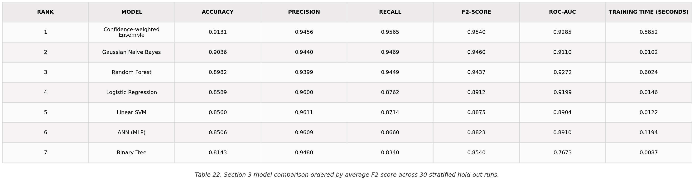
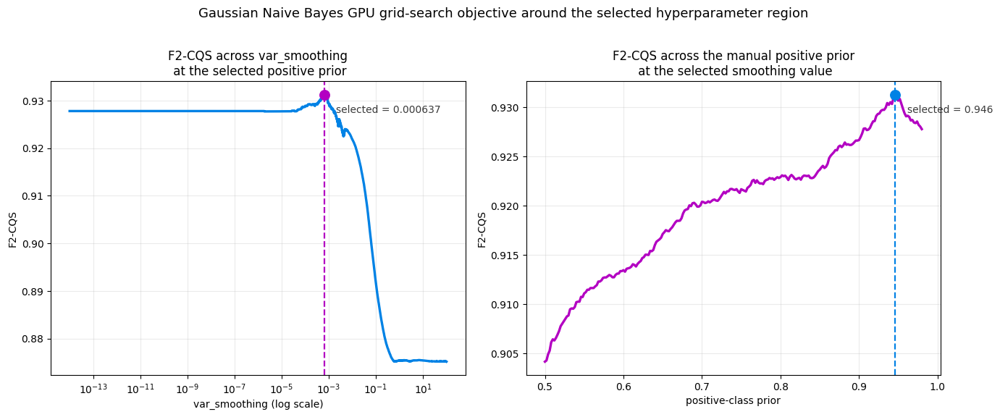
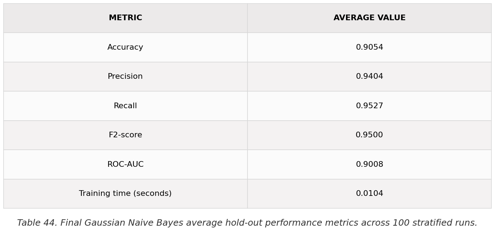
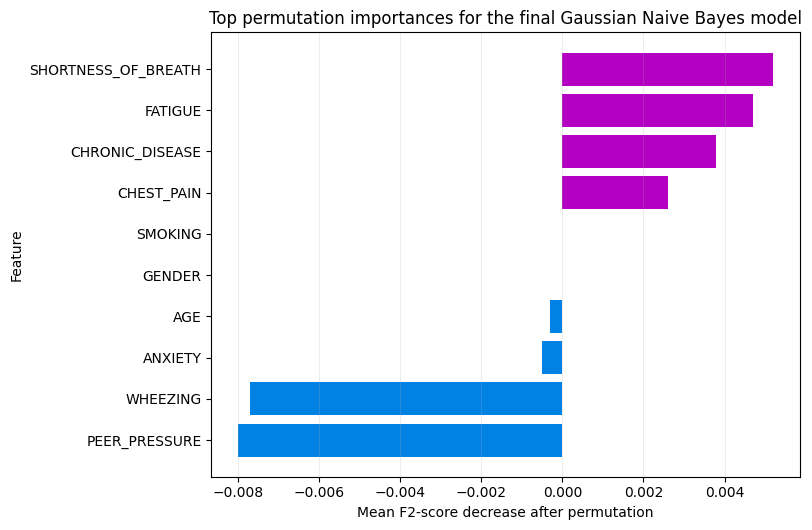

<p align="center">
  <a href="https://www.lboro.ac.uk/">
    
  </a>
</p>

<h1 align="center">Machine Learning - Principles and Applications for Engineers Coursework</h1>

## Team Members

<div align="center">
  <a href="https://github.com/jamesbarlow1812"></a>
  <a href="https://github.com/JoeShade"></a>
  <a href="https://github.com/Nomo2001"></a>
  <a href="https://github.com/SimonAndreou"></a>
</div>

**Outcome:**
- Built an end-to-end supervised classification workflow for a compact lung-cancer-labelled dataset.
- Selected a tuned Gaussian Naive Bayes model after repeated stratified model comparison.
- Achieved average recall `0.9527`, `F2-score 0.9500`, and `ROC-AUC 0.9008` across `100` hold-out runs.
- Identified the strongest predictive symptom features while keeping interpretation cautious and non-clinical.

## Project Context

This project was completed for the `25WSP074 - Machine Learning - Principles and Applications for Engineers` module at [Loughborough University](https://www.lboro.ac.uk/). The aim was to develop and evaluate a supervised classifier that predicts the `LUNG_CANCER` label from demographic, lifestyle, and symptom variables.

The work is presented as a notebook-led analysis rather than a deployable software product. The main artefact is [LungCancerML.ipynb](LungCancerML.ipynb), which moves from problem framing and data preparation through exploratory analysis, model selection, final evaluation, interpretation, and limitations.

## Dataset Preparation

The raw dataset contained `309` rows and `16` columns. Initial inspection found no missing values, but it did reveal inconsistent column naming, binary variables encoded as `1/2`, and a suspicious duplicate-heavy block at the end of the file.

The final `30` raw rows were removed as one appended block. Within that block, `25 of 30` rows were exact duplicate flags, compared with only `8 of 279` duplicate flags in the earlier rows. This left a working dataset of `279` rows for analysis.

<p align="center">
  
</p>

After cleaning, the target remained heavily imbalanced: `244` cancer-labelled records and `35` no-cancer records. This made accuracy alone a weak success measure, because the majority-class baseline accuracy was already `87.5%`.

<p align="center">
  
</p>

## Exploratory Analysis

Exploratory analysis focused on whether the available symptom and lifestyle fields carried usable signal before modelling. Several binary features showed much larger differences between the cancer and no-cancer groups than age did, including `ALLERGY`, `SWALLOWING_DIFFICULTY`, `ALCOHOL_CONSUMING`, `WHEEZING`, `COUGHING`, and `CHEST_PAIN`.

<p align="center">
  
</p>

<p align="center">
  
</p>

## Feature Engineering

Feature engineering was tested cautiously rather than assumed to improve the model. The notebook created provisional grouped signals from correlated symptom and lifestyle variables, including `BATCH_1`, `BATCH_2`, and `BATCH_3`, and also carried a binned version of age (`AGE_BINS`) alongside the raw age field.

These additions were evaluated against the original predictor set using repeated stratified hold-out runs. Including the engineered batch features reduced the mean `F2-score` from `0.9460` to `0.9319`, so the final model used the original predictors only. Further checks also supported retaining non-significant original variables, avoiding SMOTE, and keeping plausible age outliers.

<p align="center">
  
</p>

## Model Selection

Several candidate classifiers were evaluated across repeated stratified hold-out runs so that the result was not driven by one favourable train-test split. The comparison prioritised recall-weighted performance because false negatives matter more than headline accuracy in this health-related classification setting.

The confidence-weighted ensemble had the highest average `F2-score`, but Gaussian Naive Bayes was close behind, much faster, simpler, and easier to explain. A Welch test on the top two model scores found no significant difference, supporting the choice of the simpler model for the final analysis.

<p align="center">
  
</p>

## Optimisation

After Gaussian Naive Bayes was selected, the final tuning step searched over `var_smoothing` and manual class-prior values. The search used the recall-weighted `F2-CQS` objective so that optimisation stayed aligned with the project goal rather than simply improving raw accuracy.

The selected configuration was `var_smoothing = 0.000637` with class priors `[0.054, 0.946]`. The external grid search evaluated `968,242` configurations across `100` stratified hold-out reruns per configuration and was accelerated with CuPy on an NVIDIA RTX 2070.

<p align="center">
  
</p>

## Final Model

The final selected model was `GaussianNB(var_smoothing=0.000637, priors=[0.054, 0.946])`. It used the original predictors only, retained statistically non-significant original features, did not use SMOTE, and kept the plausible age outliers in the dataset.

The final estimate was averaged across `100` stratified `80/20` hold-out runs:

<p align="center">
  
</p>

## Interpretation

Permutation importance was used as an explanation aid rather than as a causal claim. The strongest final-model contributors to the recall-weighted objective were:

- `SHORTNESS_OF_BREATH`
- `FATIGUE`
- `CHRONIC_DISEASE`
- `CHEST_PAIN`

<p align="center">
  
</p>

## Limitations

This is an academic machine learning analysis, not a clinically validated diagnostic tool. The dataset is small, heavily imbalanced, internally validated only, and has limited background provenance. The final model's high-recall behaviour also increases the false-positive trade-off, and Gaussian Naive Bayes may under-model interactions because of its independence assumption.

Feature importance should therefore be read as evidence about patterns in this coursework dataset, not as proof of clinical significance or causality.

## Explore The Work

<details>
<summary>Repository and reproduction notes</summary>

Use Python `3.10` for the intended coursework environment.

```powershell
python -m venv .venv
.venv\Scripts\Activate.ps1
python -m pip install -e ".[dev]"
```

Open the main notebook:

```powershell
jupyter notebook LungCancerML.ipynb
```

Export notebook code for regression testing:

```powershell
python scripts\extract_notebook_code.py
```

Run the regression tests:

```powershell
python -m pytest
```

Regenerate the README-ready notebook figures and tables:

```powershell
python scripts\extract_notebook_assets.py --clean
```

Key repository files:

- [LungCancerML.ipynb](LungCancerML.ipynb): main notebook and primary coursework artefact.
- [datasets/givenData.csv](datasets/givenData.csv): canonical input file used by the notebook.
- [datasets/kaggleData.csv](datasets/kaggleData.csv): matching secondary dataset copy retained for reference.
- [assets/notebook_exports/manifest.csv](assets/notebook_exports/manifest.csv): exported figure/table asset index.
- [docs/dataset-notes.md](docs/dataset-notes.md): dataset interpretation notes.
- [docs/deviations.md](docs/deviations.md): active mismatches between intended and current project state.

</details>
